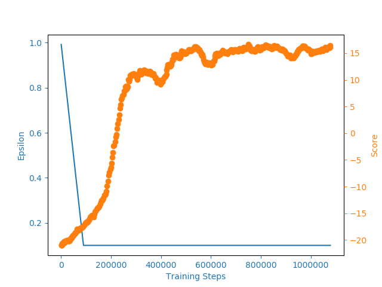

# DQN-pytorch
 Collection of DQN variations from papers, implemented in pytorch  
    
 
--- Gif of gameplay here 
 
 ### DQN
 Implementation of [Human-level control through deep reinforcement learning](https://web.stanford.edu/class/psych209/Readings/MnihEtAlHassibis15NatureControlDeepRL.pdf)
 #### Summary
 Intoducing Convolutional Layers and a memory network will allow the DQN to perform better than a standard linear DQN
 #### Results
 **Pong** results of DQN trained on 500 episodes 

